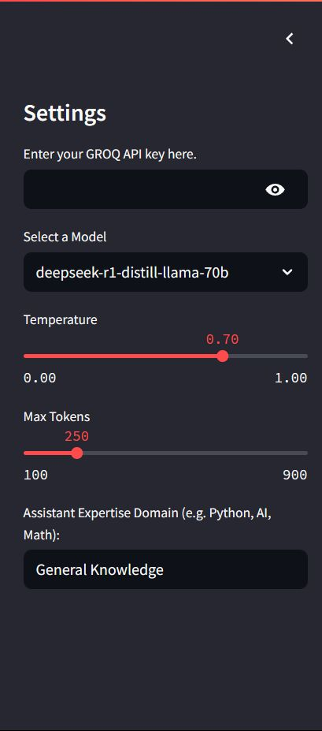
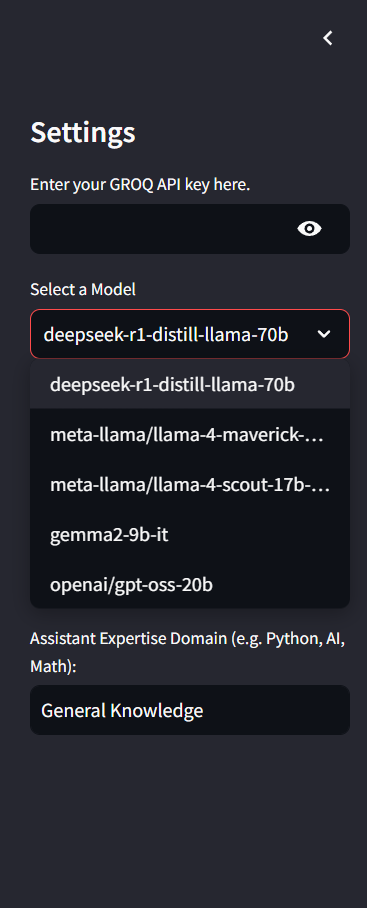
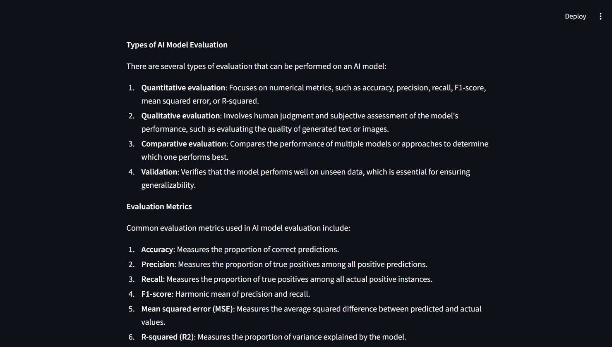
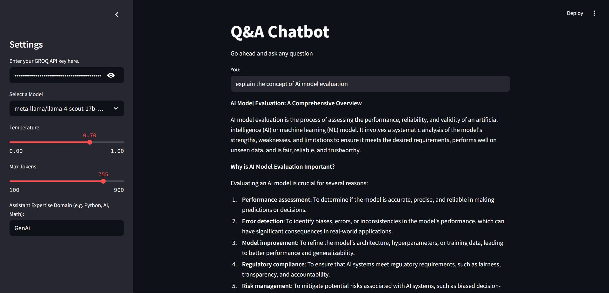

# Q&A Chatbot (LangChain + Groq + Streamlit)

An interactive Q&A chatbot built with **Streamlit**, **LangChain**, and **Groq** models. Ask questions, choose a model, tune generation settings, and get instant answers.

---

## 🚀 Features

- Multiple Groq-supported models (LLaMA 4 variants, DeepSeek, Gemma, etc.)
- Adjustable temperature and max tokens
- Clean Streamlit UI with sidebar controls
- Optional LangSmith/Tracing via LangChain

---

## 📦 Requirements

- Python 3.10+
- Groq API key (create one at `https://console.groq.com`)

---

## ⚙️ Setup

1) Create a virtual environment (recommended) and install dependencies

```bash
pip install -r requirements.txt
```

2) (Optional) Add a `.env` for LangChain/LangSmith tracing

```bash
# .env
LANGCHAIN_API_KEY=your_langchain_api_key   # optional
```

Note: Tracing is enabled in the app with `LANGCHAIN_TRACING_V2=true` and a project name. Providing `LANGCHAIN_API_KEY` is optional.

---

## ▶️ Run the App

```bash
streamlit run app.py
```

Then open `http://localhost:8501`.

---

## 🧑‍💻 Usage

1) Open the sidebar
2) Paste your **Groq API key**
3) Select a model
4) Adjust temperature and max tokens
5) Type your question in the main input and submit

---

## 🤖 Supported Models (configured in app)

- `deepseek-r1-distill-llama-70b`
- `meta-llama/llama-4-maverick-17b-128e-instruct`
- `meta-llama/llama-4-scout-17b-16e-instruct`
- `gemma2-9b-it`
- `openai/gpt-oss-20b`

---

## 🧠 Tech Stack

- **LangChain** (`langchain`, `langchain-core`)
- **Groq** via `langchain-groq`
- **Streamlit** UI
- **python-dotenv** for env management

---

## 📸 Screenshots

  





---

## 🗂️ Project Structure

```
QnA_Chatbot/
├─ app.py              # Streamlit app entrypoint
├─ requirements.txt    # Python dependencies
├─ assets/             # Screenshots and images
└─ README.md
```

---

## ❓ Troubleshooting

- "Please enter your GROQ API key" — add your key in the sidebar before asking.
- Empty/slow responses — try a different model, lower temperature, or fewer tokens.
- Port already in use — run `streamlit run app.py --server.port 8502`.
- Tracing not visible — set `LANGCHAIN_API_KEY` in `.env` and restart.

---

## 🤝 Contributing

Issues and PRs are welcome: improve prompts, UI, or add model options.

---

## 📄 License

Add your preferred license (e.g., MIT) in a `LICENSE` file.
